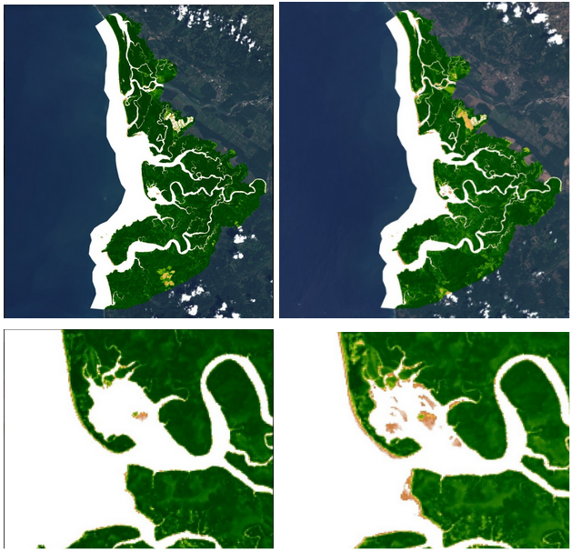

# Variación en los sólidos, sedimentos y cobertura vegetal en el Humedal Nacional Térraba-Sierpe, Osa, Puntarenas, Costa Rica en la estación seca - lluviosa,  2018 - 2019  

### Esta página corresponde a una recopilación del trabajo final realizado en el curso de Fotogrametría y Teledetección, ciclo II, año 2021.  
#### Autores del trabajo: 
- Allan Chinchilla;
- David Youna;
- Jose Umaña.

## Resumen

En dicho trabajo consiste en un estudio de teledetección en el Humedal Nacional Térraba-Sierpe, el cual se encuentra localizado en el cantón Osa, Puntarenas. Es uno de los manglares más extensos de Centroamérica con más de 14 000 Ha, se encuentra en condiciones climáticas tropicales, debido a esto, presenta condiciones húmedas durante todo el año. Esto incrementa el desarrollo de una cobertura tropical y la respectiva dinámica de dispersión de sedimentos. Para este estudio realizaron una comparación por medio de imágenes satelitales de Landsat 8 y Sentinel 2 entre los años 2018-2019, para así determinar patrones con respecto a la variación de la cobertura vegetal, sólidos y sedimentos disueltos en el manglar. Los resultados obtenidos en el estudio arrojaron variaciones en la época seca y lluviosa en cuanto a los sólidos y sedimentos disueltos en el agua, asi mismo, la cobertura vegetal muestra diferencias mínimas entre los periodos de estudio. 

*Fig 1*. Humedal Nacional Térraba-Sierpe. Tomada de: [QCOSTARICA](https://qcostarica.com/humedal-nacional-terraba-sierpe/)

## Metodología

1. **Colección de imágenes y bandas**

Los procesos de recopilación de información se realizaron por medio de Google Earth Engine. Para el calculo de índice de sedimentos disueltos, utilizaron tres bandas (B2, B4 y B8) de la colección sentinel S2 (Sentinel-2 MSI: MultiSprectral Instrument, Level-1C), estas bandas se multiplican por 3, por 5 y por 2, respectivamente, para así realizar una sumatoria final, generando una nueva colección, con los valores ajustados. 
Para el NDVI utilizaron las bandas B5 y B4, mediante el método de NormalizedDifference, utilizando la colección LandSat 8 (USGS Landsat 8 Collection 1 Tier 1 and Real-Time Data TOA Reflectance) 

2. **Procesamiento de los datos**

Para la colección del índice de sedimentos, se filtraron las imágenes por fechas, también utilizaron la propiedad llamada *“Cloudy_Pixel_Percentage”* con *“Less_Than”* con un valor de 20, así seleccionan las imágenes con menos nubosidad.  Para un análisis cuantitativo utilizaron de apoyo una imagen RGB con máscara de nube. Además, seleccionan dos sectores para así comparar las imágenes en ambas estaciones (época seca/lluviosa), las variables comparadas fueron el valor de longitud de onda contra la reflectancia total. Valores tomados desde los metadatos de la colección Sentinel S2.  
Para el NDVI, con las bandas seleccionadas, por medio del NormalizedDifference, con una paleta de colores especificas mostraron de una mejor manera el índice. 

# Resultados

## Sedimentos disueltos y sólidos en el Humedal Nacional Térraba – Sierpe.  
Identificaron zonas con aumento o disminución de arrastre de sedimentos, así mismos sedimentos disueltos en el agua, el mayor arrastre de sedimentos se presenta sobre la desembocadura del Río Térraba, de igual forma para el estero presente en el humedal.
Igualmente, detectaron sólidos, los cuales se clasificaron o se determinaron como sólidos en las líneas de costa establecidas, por lo cual los resultados variaron debido al aumento o disminución de las mareas.  En las reflectancias, las tendencias entre estaciones fueron similares.  Los sedimentos presentan una mayor reflectancia en los valores del infrarrojo cercano, pero al encontrarse por debajo o disueltos en el agua, los valores pueden variar.  

## NDVI  
No identificaron cambios anormales en la cobertura vegetal en las dos estaciones, los valores de los pixeles del índice se mantuvieron constantes. Para el año 2018, los valores son ligeramente mayores, a diferencia del periodo 2019. Pudieron identificar una ligera disminución en el volumen de agua en Humedal. 

*Fig 2*. NDVI del Humedal Nacional Térraba-Sierpe.
